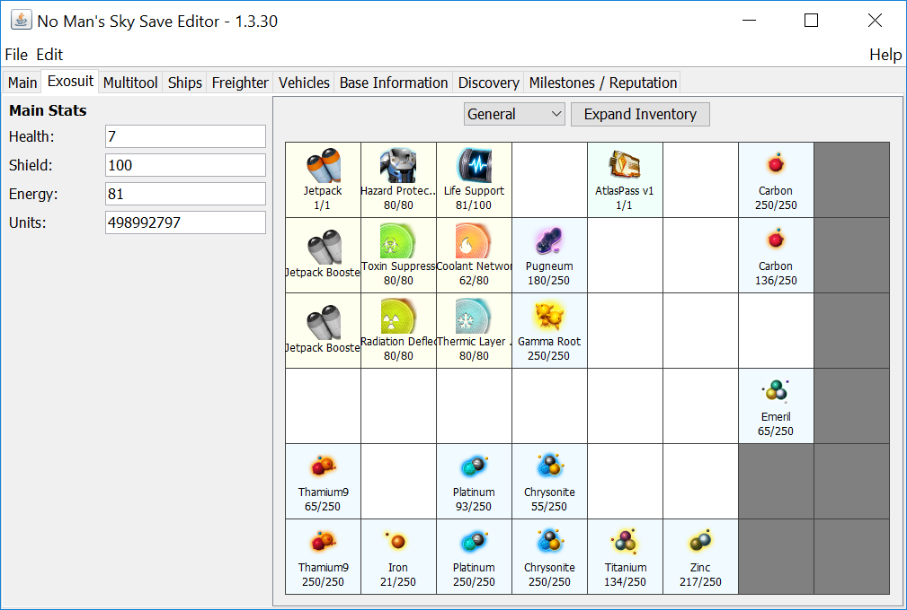
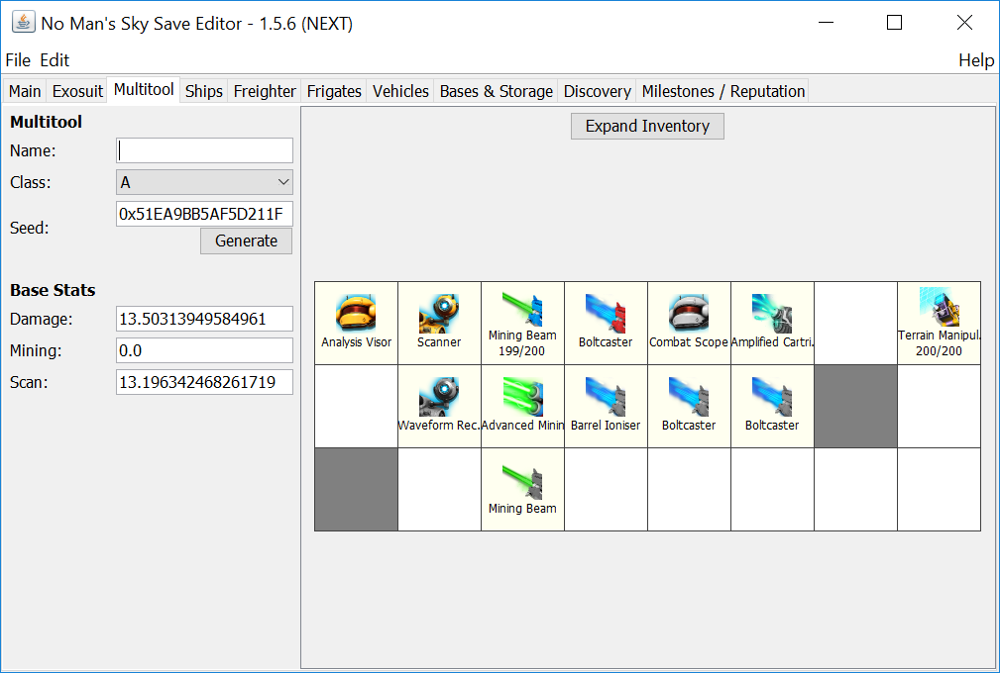
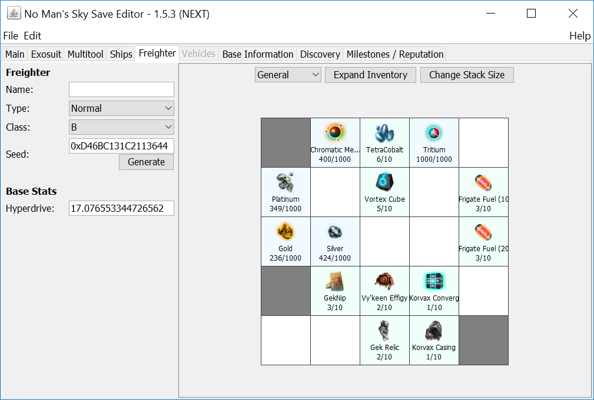
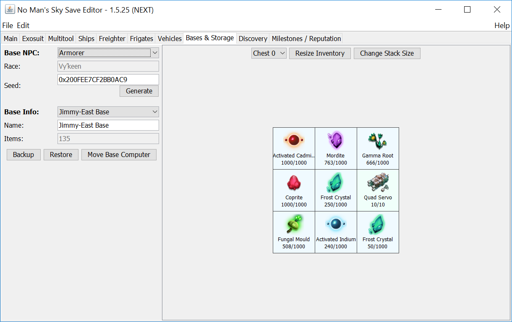
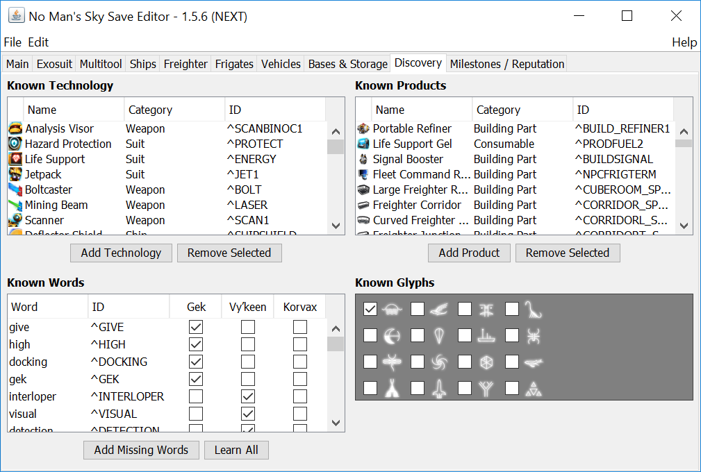
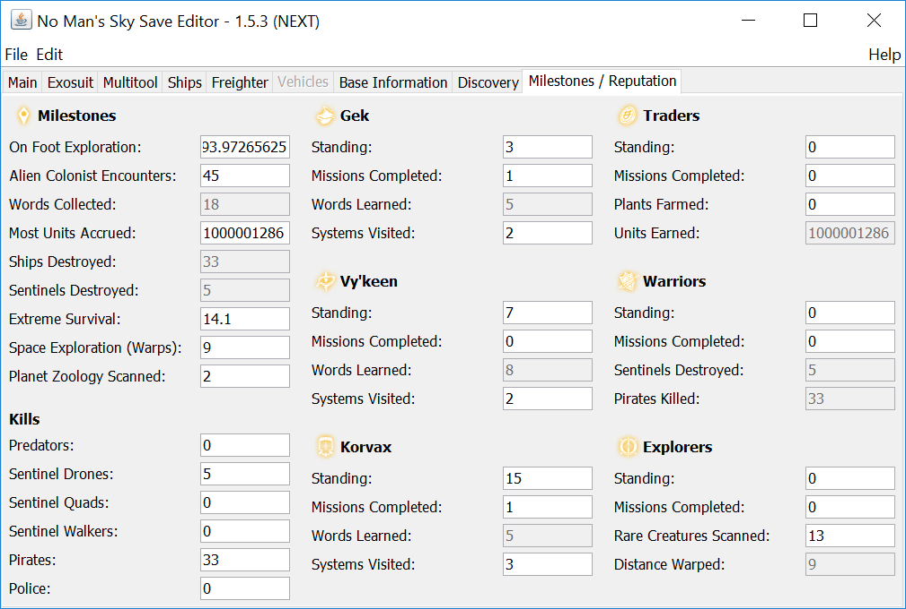
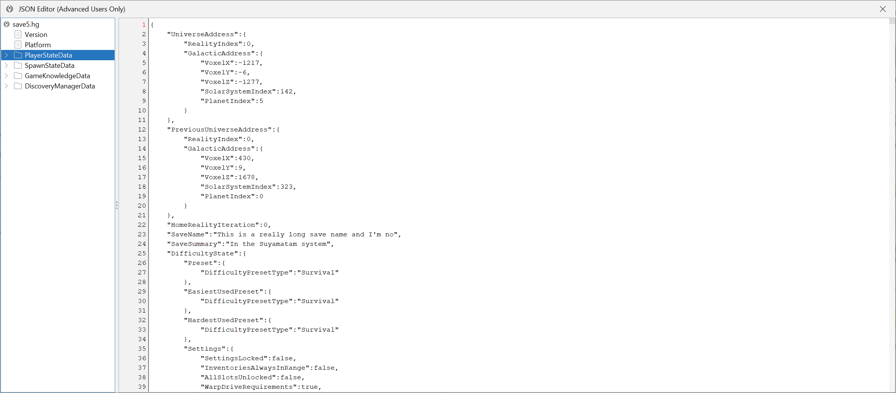

# No Man's Sky - Save Editor (for NEXT)

## Introduction

Since No Man's Sky first came out, there have been many notable game-breaking bugs as well as many parts of the game that seemed too grindy and not much fun. Some of the bugs had workarounds or later patches to fix them, but others simply stopped your progress. Either way, I just want to enjoy the game!

After many tedious searches trying to find a solution, I came across a save editor that allowed me to make a change to the save file, but it was very limited in what it could do, and unless you were very careful you could screw up your save file completely. So I decided to rewrite it in Java for fun, with a simpler user interface, and as I dug deeper and added more functionality I decided to release it publicly. It has grown to become a pretty useful tool.

### Features

- Easy to use UI.
- Ability to organize inventory (exosuit, multitool, ships, freighter, vehicles, and base storage)
  - Move items and technology around (drag & drop, right-click menu)
  - Add items and technology (right-click menu, CTRL-drag & drop)
  - Repair items and slots (right-click menu)
  - Unlock additional slots (right click menu), and resize inventories (to maximum 8x6)
- Ability to change data values, such as number of units, classes, seeds, and base stats, etc.
- Ability to view more information about each of the items in your inventory, such as in-game description, names, etc.
- Ability to edit the known technology, products lists, words, and glyphs.
- Ability to recharge all technologies, refill all item stacks, expand all inventories to 8x6, and enable all inventory slots using a simple menu option.
- Ability to edit the game stats that are used for milestones and faction reputation.
- Ability to edit the raw JSON in the save file (for advanced users only).
- Automatic backup and recovery of all saves (in case you screw up something).
- Backup/Restore of planet/freighter base structures, usable across different systems or saves.
- Ability to manage your entire fleet of frigates.

### Screenshots

  
  
 More screenshots can be found [here](screenshots).

## Compatibility

Requirements:
- No Man's Sky - NEXT (PC)
- <a href="https://java.com/en/download/manual.jsp" target="_blank">Java Runtime Environment 8</a>

## Installation

1. Download the [latest version](../../raw/nextVisions/NMSSaveEditor.exe).
2. Run the exe and extract the contents of the zip file to an empty folder somewhere.
3. Run the bat file (or the jar file if the file extension is associated to java).
4. When the main window opens, locate the folder that your saves are in, and choose the most recent.
5. Start tinkering!

## Frequently Asked Questions

Frequently asked questions can be found [here](FAQ.md).

## Contribution

This tool will always be released publicly for free, and I intend to continue maintaining it for as long as there is interest in the game. If this tool has been useful and you want to contribute to it's further development, feel free to visit me on Patreon:
https://www.patreon.com/goatfungus

## Previous Releases

- [Atlas Rises (1.3)](../atlasRises/README.md)
