# No Man's Sky - Save Editor (for WORLDS)

## Introduction

Since No Man's Sky first came out, there have been many notable game-breaking bugs as well as many parts of the game that seemed too grindy and not much fun. Some of the bugs had workarounds or later patches to fix them, but others simply stopped your progress. Either way, I just want to enjoy the game!

After many tedious searches trying to find a solution, I came across a save editor that allowed me to make a change to the save file, but it was very limited in what it could do, and unless you were very careful you could screw up your save file completely. So I decided to rewrite it in Java for fun, with a simpler user interface, and as I dug deeper and added more functionality I decided to release it publicly. It has grown to become a pretty useful tool.

### Features

- Easy to use UI.
  - Ability to customise Look & Feel (Light / Dark modes, inventory scaling)
- Change data values:
  - Currencies (Units, Nanites and Quicksilver)
  - Base stats for Exosuit, Multitools, Ships and Freighter (Health, Shield, Type, Class, Seed, etc.)
  - Squadron Wingmans (NPC Race, NPC Seed, Ship Type, Ship Seed, Pilot Rank, etc.)
  - Frigates Info and Stats
  - Companions / Pets (Name, Seed, Biome, Type, etc.)
  - Settlements (Population, Happiness, Production, Upkeep, Debt, etc.)
  - Milestones / Reputation
- Organize and manage inventories (Exosuit, Multitools, Ships, Freighter, Vehicles, and Base Storages)
  - Move items and technology around.
    - Drag & drop to move in the same inventory
    - Right-click menu to move to another inventory
  - Add items and technology.
    - CTRL + Drag & drop to clone same item / technology
    - Right-click menu to choose specific item / technology
  - View more information about each of the items in your inventory, such as in-game description, names, etc.
  - Repair, Recharge and Refill items / technologies (right-click menu)
  - Resize inventories (top button), Enable or Enable All additional slots (right-click menu)
  - Vanilla inventory limits (Cargo - 10x12 / Technology - 10x6 / Base Storage - 10x5) (**WARNING! You CAN go above this, but the game might BREAK!**)
- Edit the raw JSON in the save file (for advanced users only).
- Automatic backup and recovery of all saves (in case you screw up something).
- Backup/Restore of Base/Freighter Structures (Usable across different systems or saves)
- Delete or Export/Import Multitools, Ships and Frigates.
- Edit and toggle:
  - Known Technologies, Products, Words and Glyphs.
  - Your account data and unlocks.
- Currently supports Steam/GOG, PS4 (via Save Wizard), and MS Game Pass (Xbox).

### Screenshots

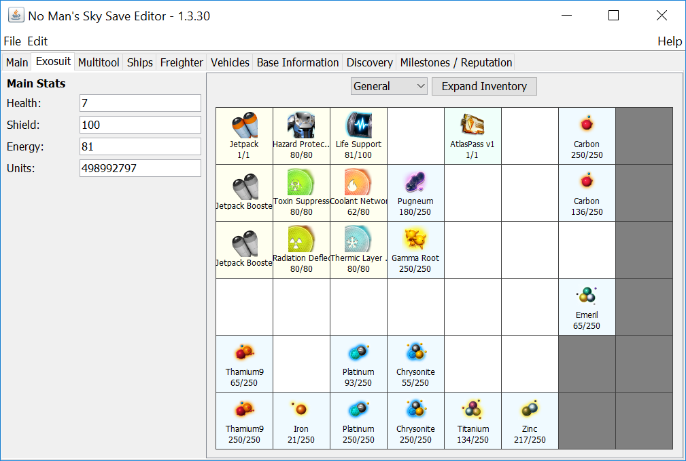 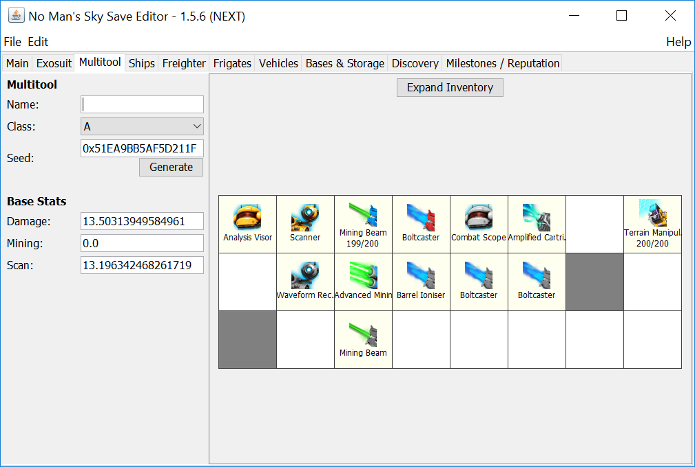 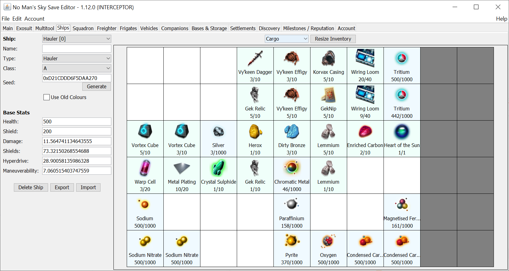
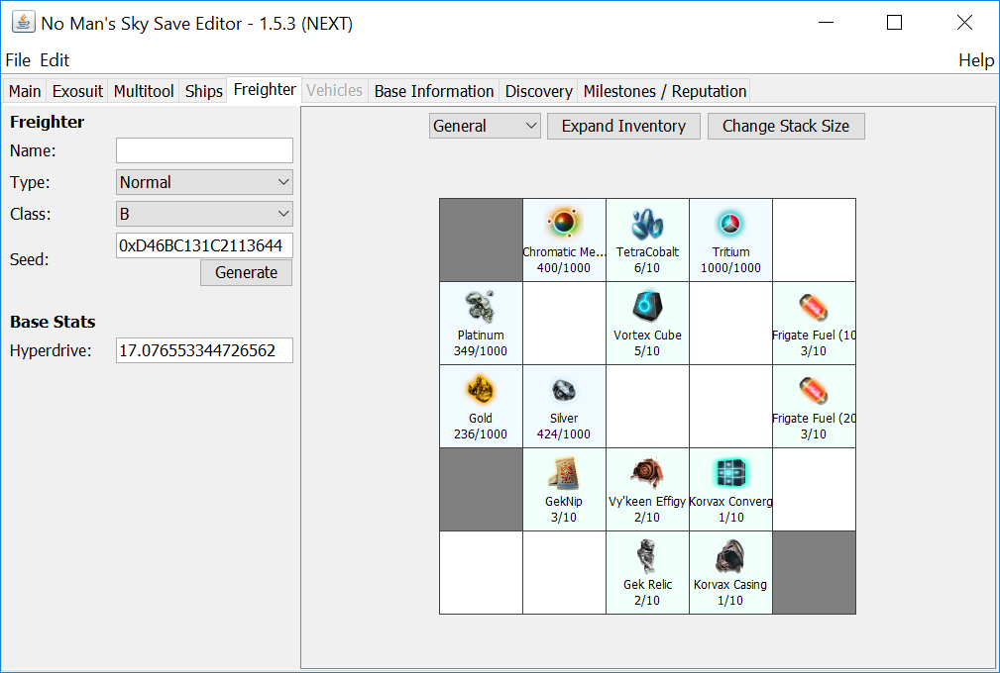 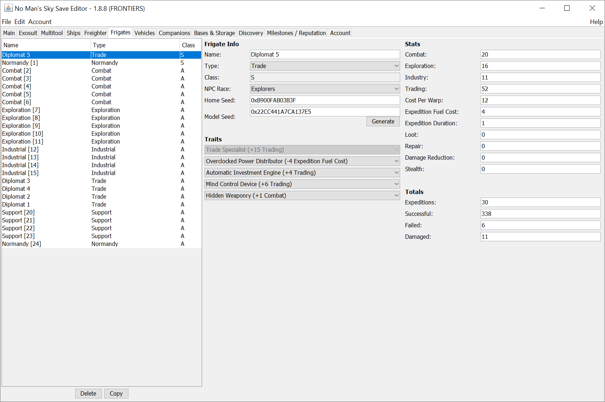 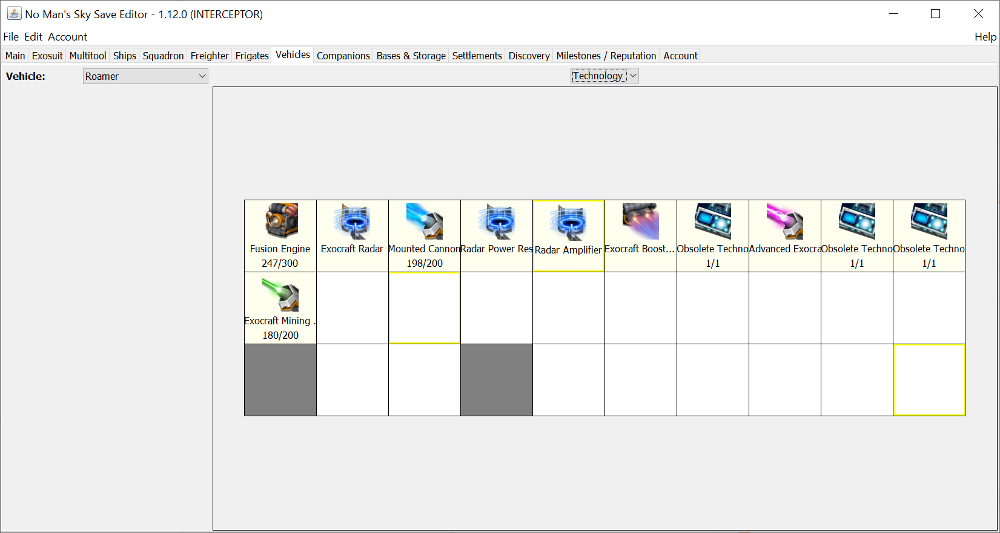
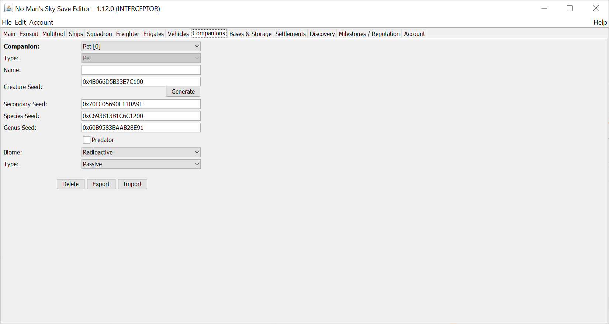 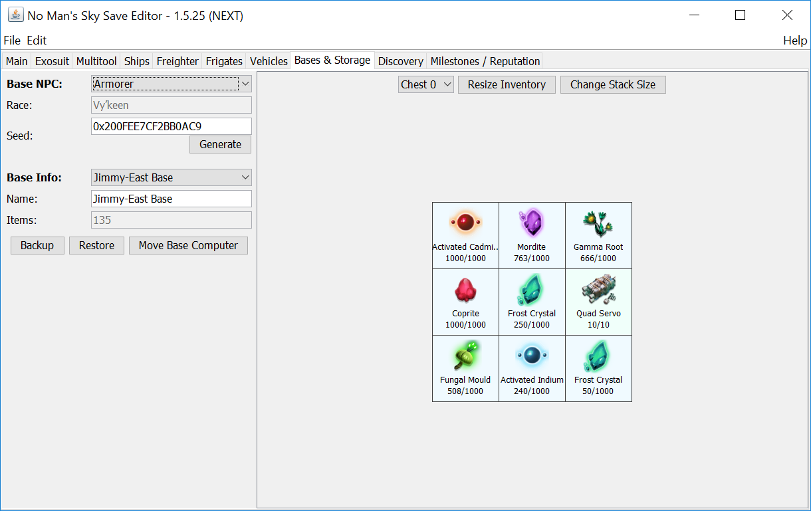 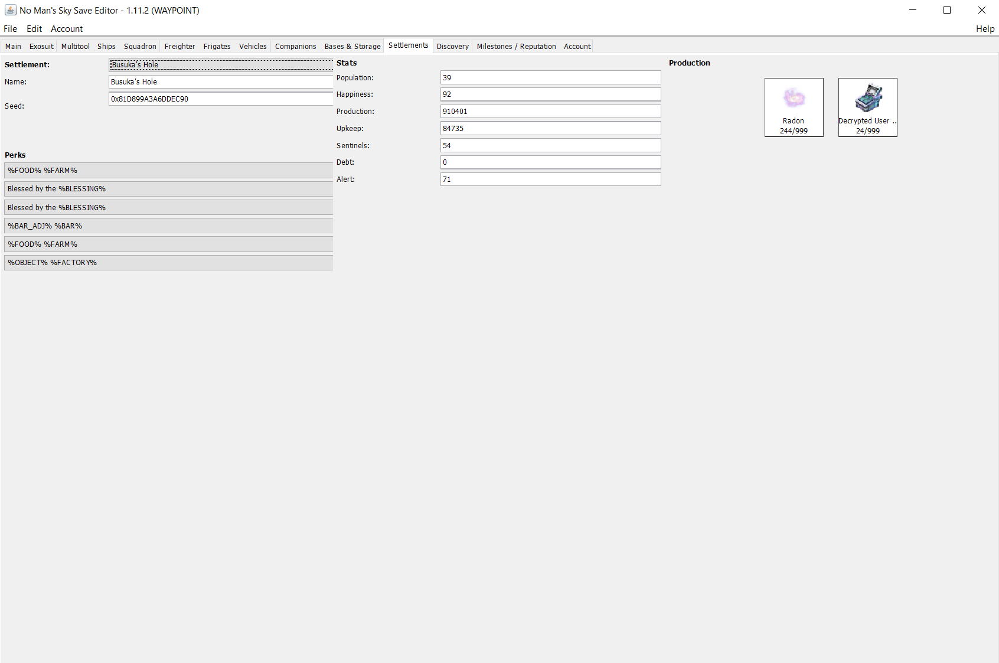
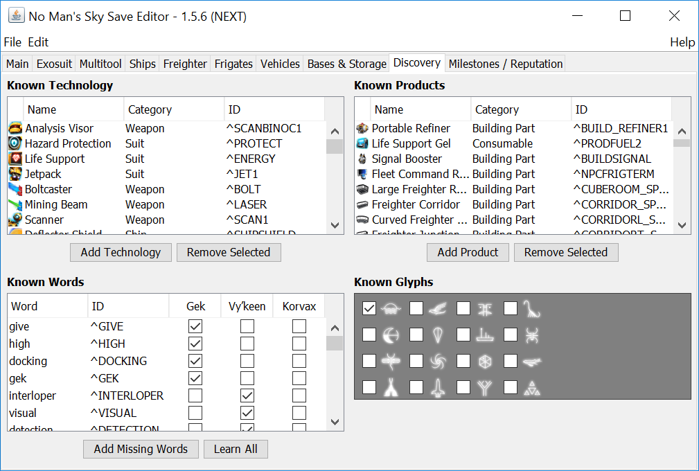 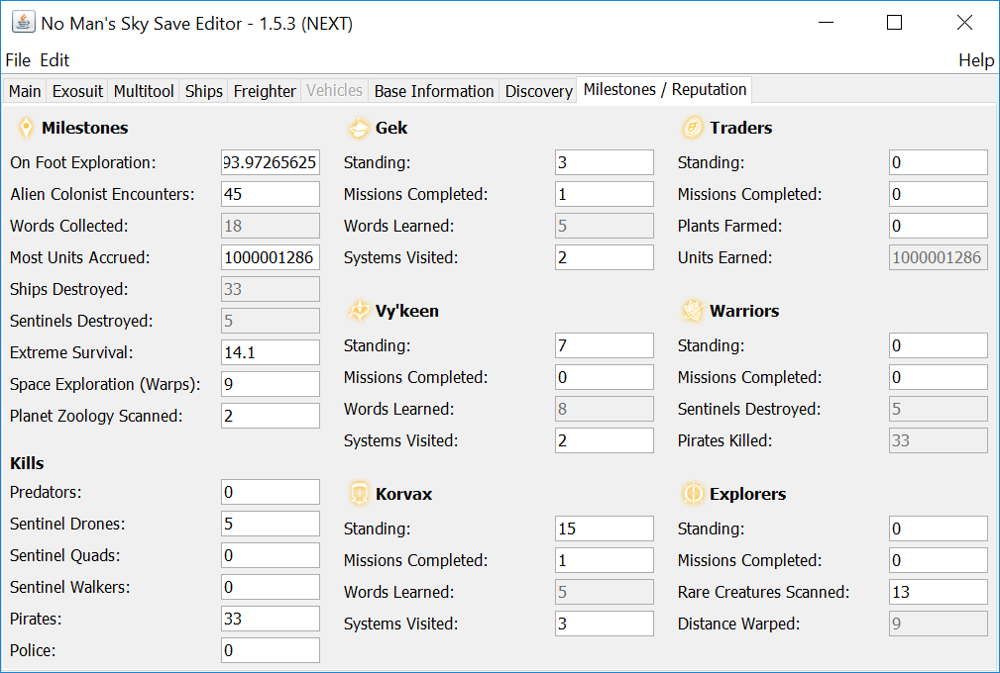 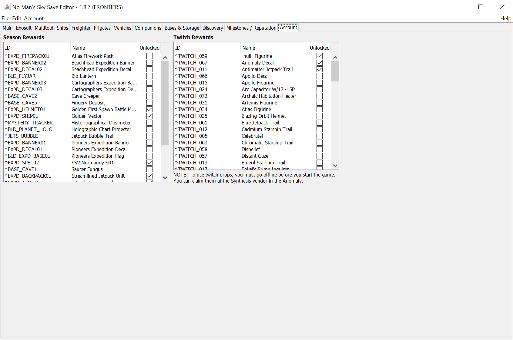
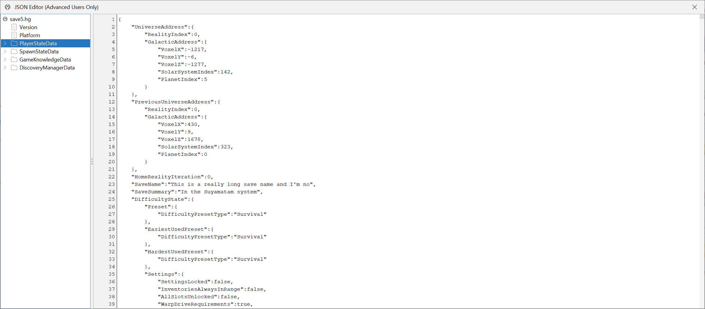 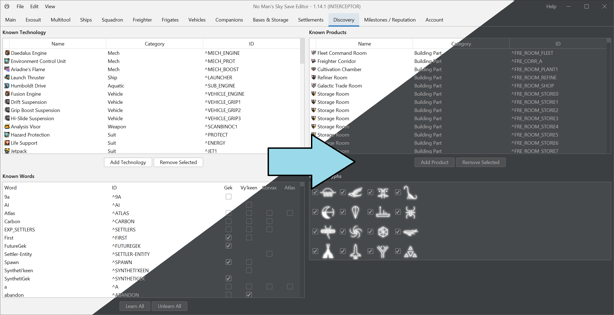 More screenshots can be found [here](screenshots).

## Compatibility

Requirements:
- No Man's Sky - WORLDS (PC/Xbox/PS4)
- <a href="https://www.savewizard.net/" target="_blank">Save Wizard</a> (PS4 only)
- <a href="https://java.com/en/download/manual.jsp" target="_blank">Java Runtime Environment 8</a>

## Installation

### Option 1 - Self-Extracting Zip Archive

1. Download the [latest version](../../raw/master/NMSSaveEditor.exe).
2. Run the exe and extract the contents of the zip file to an empty folder somewhere.
3. Run the bat file (or the jar file if the file extension is associated to java).
4. When the main window opens, locate the folder that your saves are in, and choose the most recent.
5. Start tinkering!

_NOTE: Some antivirus solutions actually falsely flag the above EXE file as a "virus". If this happens for you, try option 2 instead._

### Option 2 - Manual Zip Download

1. Download the zip file manually from here: [https://github.com/goatfungus/NMSSaveEditor/raw/master/NMSSaveEditor.zip](../../raw/master/NMSSaveEditor.zip).
2. Open the zip file with 7-Zip / WinRar (or equivalent).
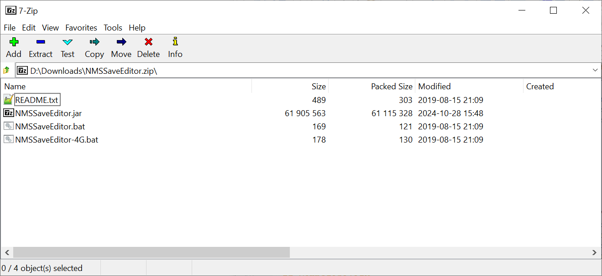

3. Extract the files to an empty folder somewhere. DO NOT try to run the program from inside the zip file!
4. Run the bat file (or the jar file if the file extension is associated to java).
5. When the main window opens, locate the folder that your saves are in, and choose the most recent.
6. Start tinkering!

### Option 3 - Linux & Steam Deck Guide

You can easily run the NMS Save Editor on Linux or Steam Deck by running the `.jar` package using Java.

#### Step 1: Install Java (JRE)

To run the JAR file, you need Java installed on your system.
For the **Steam Deck**:
1. Download Java JRE from an official source (e.g., [Adoptium](https://adoptium.net/) or Oracle). Choose **Linux**, **x64**, **JRE**, and a modern version such as **21-LTS**.
2. Extract the downloaded archive somewhere on your system (e.g., your `Downloads` folder).
3. From your Home folder, navigate to `~/.local/share/applications` (you may need to enable "Show Hidden Files" in your file manager to see the `.local` folder).
4. Right-click in the directory, create a new text file named `Java.desktop`, and add the following content (making sure to replace `/home/deck/Downloads` with the actual path where you extracted the Java JRE):
   ```ini
   [Desktop Entry]
   Name=Java
   Comment=Java
   Keywords=java
   Exec=/home/deck/Downloads/jdk-21.0.6+7-jre/bin/java -jar %f
   Terminal=false
   Type=Application
   MimeType=application/x-java-archive
   NoDisplay=true
   ```
5. Save and close the file. You can now double-click any `.jar` file to run it.

On other **Linux distributions**, you can simply install Java via your package manager (e.g., `sudo apt install default-jre` on Debian/Ubuntu, or `sudo dnf install java-latest-openjdk` on Fedora).

#### Step 2: Download and Extract the Editor

1. Download the manual zip version of the NMS Save Editor from [Option 2](#option-2---manual-zip-download).
2. Extract the contents of the zip file to a folder of your choice.

#### Step 3: Create a Shortcut to Save Files (Optional)

Steam games running under Proton store their save files deep inside Steam's virtual Wine prefixes. Creating a desktop shortcut/link to your `compatdata` directory makes it much easier to open your saves in the editor.
1. Navigate to `/home/deck/.local/share/Steam/steamapps` (or `~/.local/share/Steam/steamapps` on standard Linux installations).
2. Right-click on the `compatdata` folder and choose **Copy Location** (or "Copy").
3. Go to your desktop, right-click, choose **Create New** -> **Link to File or Directory...**.
4. Name the link `compatdata` and paste the path you copied.

#### Step 4: Run and Open Your Saves

1. Open the folder where you extracted the NMS Save Editor.
2. Run `NMSSaveEditor.jar` (by double-clicking it, or by running `java -jar NMSSaveEditor.jar` in a terminal).
3. When prompted to select your save's path, or by clicking **File > Open File/Path**, navigate to your Steam saves:
   - Go to your desktop `compatdata` shortcut (or navigate to `~/.local/share/Steam/steamapps/compatdata`).
   - Navigate further to: `275850/pfx/drive_c/users/steamuser/Application Data/HelloGames/NMS`
4. Choose your most recent save directory and start editing!

## Frequently Asked Questions

Frequently asked questions can be found [here](FAQ.md).

## Contribution

This tool will always be released publicly for free, and I intend to continue maintaining it for as long as there is interest in the game. If this tool has been useful and you want to contribute to it's further development, feel free to visit me on Patreon:
https://www.patreon.com/goatfungus

## Previous Releases

- [Atlas Rises (1.3)](../atlasRises/README.md)
- [Next / Visions (1.5)](../nextVisions/README.md)
- [Beyond (2.0)](../expeditionsPrisms/README.md)
- [Interceptor - Legacy UI](../legacyUI/README.md)
- [Adrift (4.5)](../adrift/README.md)
